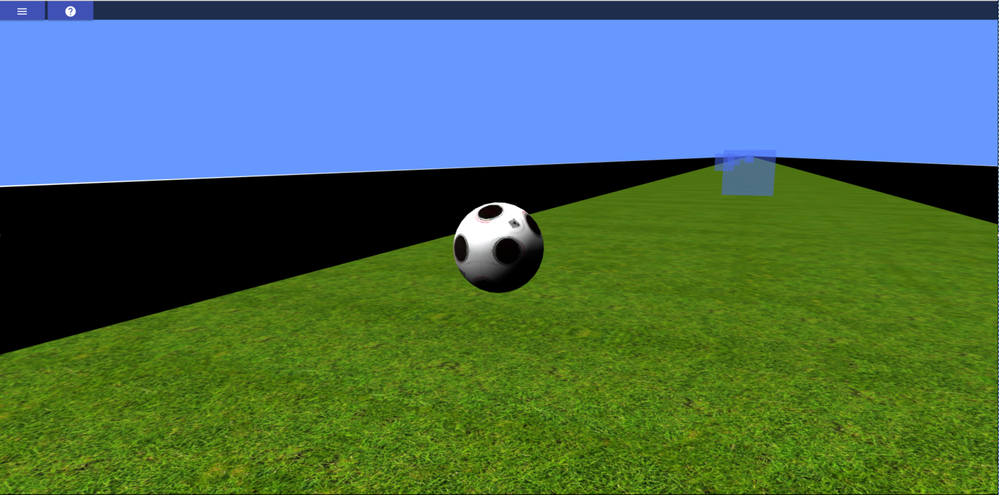

# Game Integrator Kit

<div align="center">
	<h3>Host application of WebGL games and animations</h3>
	<p>
		
	</p>
	<strong>
		<a href="https://game-integrator-kit.herokuapp.com/">Demo</a>
	</strong>
</div>

# Overview
Game Integrator Kit is the tool that allowss skip quickly the environment setup and provides tools to develop 3D animations.

- **Rendering handler.** Provides rendering container. Shows menu on start and stop rendering;
- **Responsive Interface.** Rendering container size is updated on resizing window;
- **Support parallel development of multiple animations.** It allows have more than one game/animation in same codebase and swap easily between them in the same browser session. 
- **Modular** Games are nearly independent of the kit. Kit only needs an interface to access a set of methods. Games have their own dependencies and their own repository. This allows receiving game kit updates without conflicting with existing game code.
- **Game modules.** Provides features that are tipically used in games.
	- **Countdown.** Force gamers to complete game goals. Shows lose screen if countdown ends.
	- **Catchables.** Set goal of catch every objects existing in the world. Shows win screen if all objects are collected.
- **WebGL library independent.** Animation built in any WebGL library can use the kit.
	- **Threejs.** Kit provides a class with methods and animation elements that helps integration.
- **Es6, eslint configuration, Sass, build script and jest/enzyme setup**

# Tech/framework used

- React/redux flow;
- Material UI components;
- State is saved in an immutable object;
- Enzyme is already setup;

# Usage and installation

This project was bootstrapped with Create React App.

You will find some information on how to perform common tasks in this guide [here](https://github.com/facebookincubator/create-react-app/blob/master/packages/react-scripts/template/README.md).

Clone this repository:

``` > git clone https://github.com/fabioDMFerreira/game-integrator-kit ```

Install dependencies

``` > npm install ```

Add games to `src/games` directory. Create an `index.js`, which musst export kit required methods.

```
export default {
	renderOn, // first element passed is the html element where it will be rendered
	startRender, // must start rendering
	stopRender, // must stop rendering
	setSize, // executed on window resize
	loadKit, // pass kit interface with allowed methods
	controls // [optional] indicates controls to interact with game
};
```

Start application server.

``` > npm start ```


# Deployment

Create the application optimized bundle.

``` > npm run-script build ```

Move bundle to production server and run a static server. For example [local-web-server](https://www.npmjs.com/package/local-web-server).

``` > cd <application directory> && ws --spa index.html -p 80 ```


# Contributing
Please read CONTRIBUTING.md for details on our code of conduct, and the process for submitting pull requests to us.

# Versioning
We use SemVer for versioning. For the versions available, see the tags on this repository.

# License
This project is licensed under the MIT License - see the LICENSE.md file for details.

